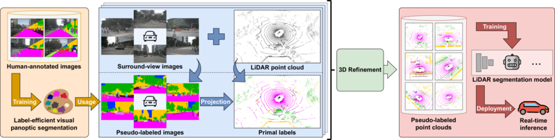

# L3PS
[**arXiv**](https://arxiv.org/abs/2503.02372) | [**Website**](https://l3ps.cs.uni-freiburg.de/) | [**Video**](https://youtu.be/389jPL83OTI)

This repository is the official implementation of the paper:

> **Label-Efficient LiDAR Panoptic Segmentation**
>
> [Ahmet Selim Canakci]()&ast;, [Niclas Vödisch](https://vniclas.github.io/)&ast;, [Kürsat Petek](http://www2.informatik.uni-freiburg.de/~petek/), [Wolfram Burgard](https://www.utn.de/person/wolfram-burgard/), [Abhinav Valada](https://rl.uni-freiburg.de/people/valada). <br>
> &ast;Equal contribution. <br> 
> 
> *arXiv preprint arXiv:2503.02372*, 2025.

<p align="center">
  
</p>

If you find our work useful, please consider citing our paper:
```
@article{canakci2025l3ps,
  author={Canakci, Ahmet Selim and Vödisch, Niclas and Petek, Kürsat and Burgard, Wolfram and Valada, Abhinav},
  title={Label-Efficient LiDAR Panoptic Segmentation},
  journal={arXiv preprint arXiv:2503.02372},
  year={2025},
}
```

**Make sure to also check out our previous works on this topic:**
- [**SPINO**](https://github.com/robot-learning-freiburg/SPINO)
- [**PASTEL**](https://github.com/robot-learning-freiburg/PASTEL)


## 📔 Abstract

A main bottleneck of learning-based models for robotic perception lies in minimizing the reliance on extensive training data while ensuring reliable predictions. In the context of LiDAR panoptic segmentation, this challenge is amplified by the need to handle the dual tasks of semantic and instance segmentation within complex, high-dimensional point cloud data. In this work, we address the problem of Limited-Label LiDAR Panoptic Segmentation (L³PS) by bootstrapping the recent advancements of label-efficient vision panoptic segmentation methods. We propose a technique that leverages a 2D label-efficient network to generate panoptic pseudo-labels from a minimal set of annotated images, which are then projected into point clouds. Utilizing the geometric properties of the point clouds, we refine these pseudo-labels through clustering techniques and enhance their accuracy by accumulating scans over time and separating ground points. The resulting pseudo-labels train an off-the-shelf LiDAR panoptic segmentation network for real-time deployment. Our approach substantially reduces the annotation burden while achieving competitive performance, offering an alternative to previous label-efficient methods.


## 👩‍💻 Code

We will release the source code upon acceptance of the corresponding paper.


## 👩‍⚖️  License

For academic usage, the code is released under the [GPLv3](https://www.gnu.org/licenses/gpl-3.0.en.html) license.
For any commercial purpose, please contact the authors.


## 🙏 Acknowledgment

This work was funded by the German Research Foundation (DFG) Emmy Noether Program grant number 468878300.
<br><br>
<p float="left">
  <a href="https://www.dfg.de/en/research_funding/programmes/individual/emmy_noether/index.html"></a>  
</p>
